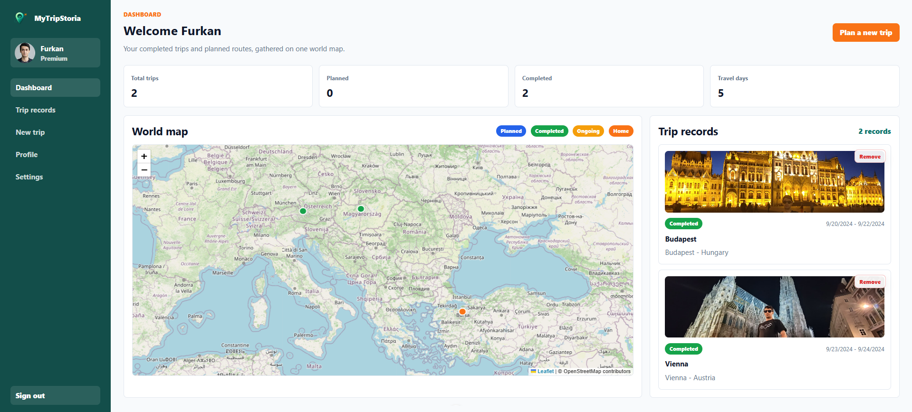
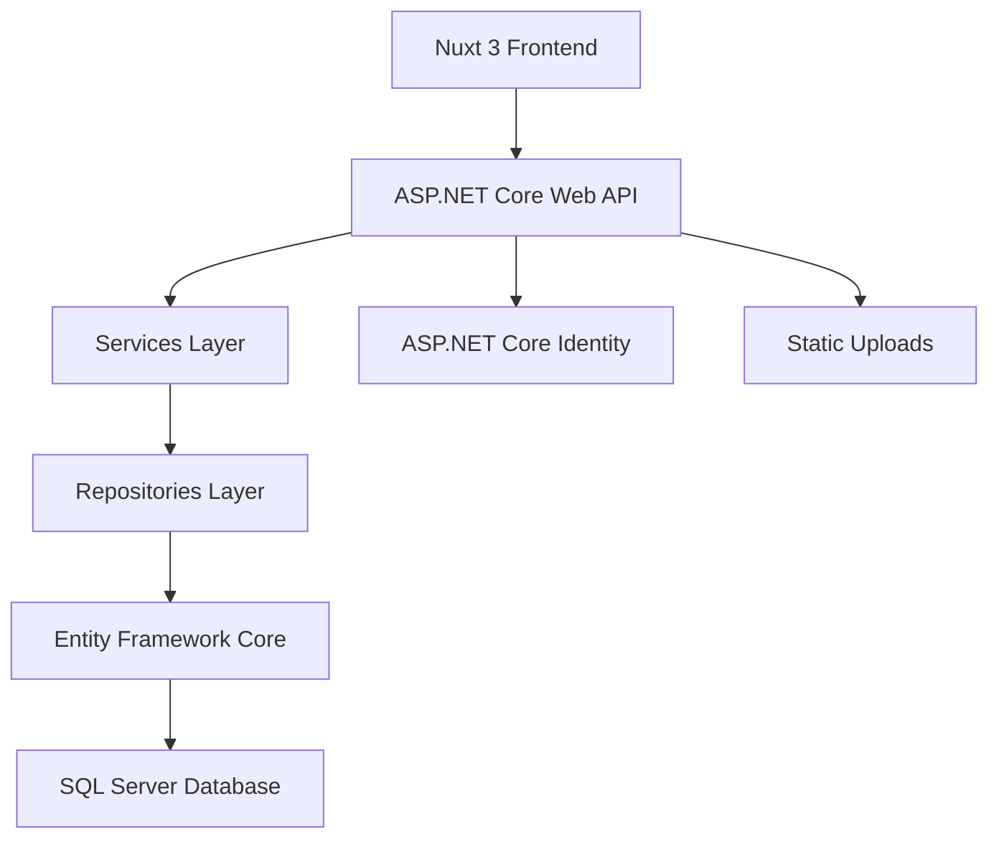
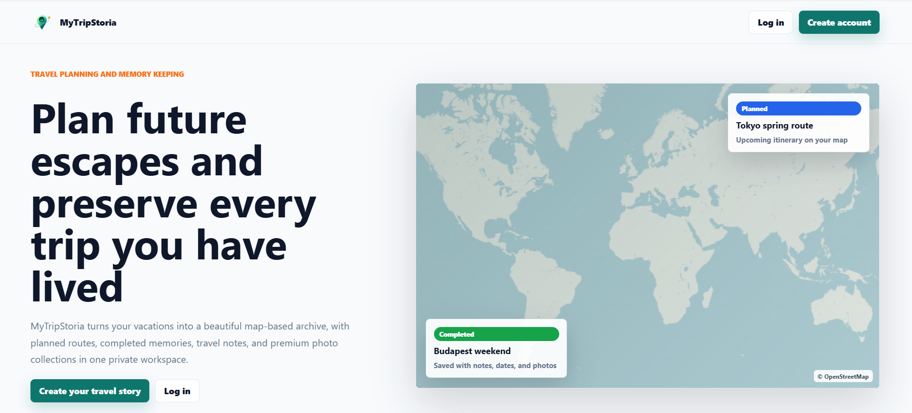
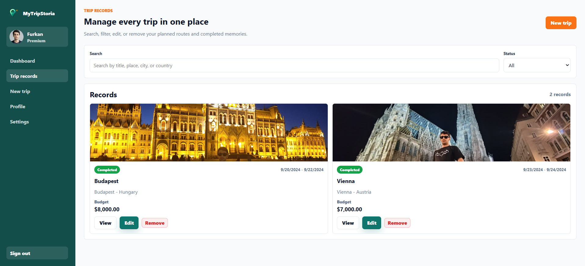
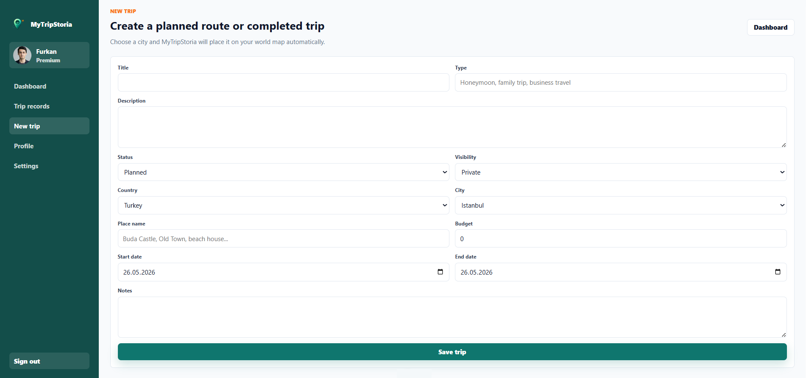
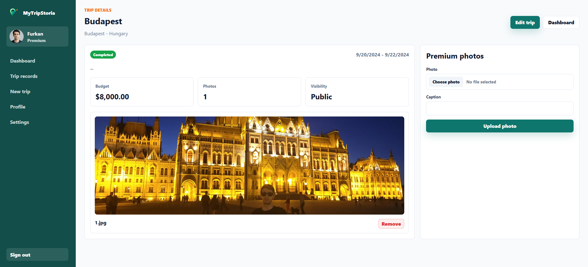
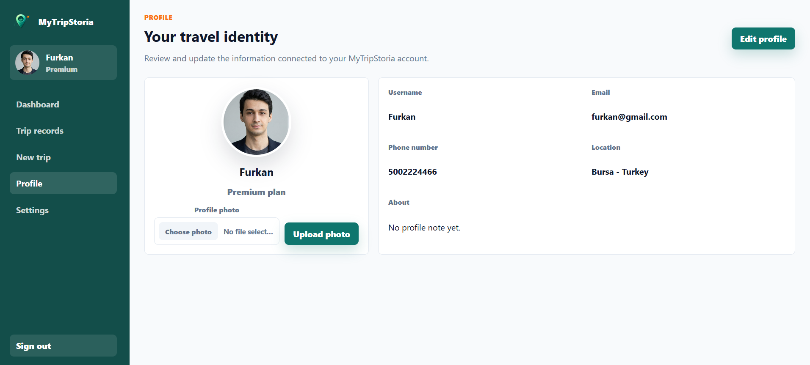
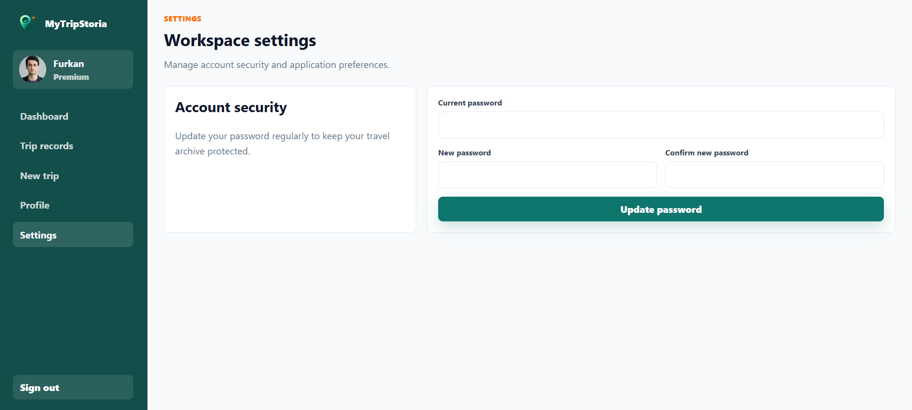

<h1 align="center">MyTripStoria</h1>

<p align="center">
  
</p>
<p align="center">
A modern travel planning and memory keeping platform built with .NET 8, Nuxt 3, Vue, Leaflet, Entity Framework Core, and SQL Server.
</p>

<p align="center">
  
  
  
  
  
  
  
  
  
  
</p>

---

## Project Overview

MyTripStoria is a full-stack travel application designed for planning future trips, preserving completed vacations, and visualizing personal travel history on a map.

The application combines authentication, profile management, trip records, planned and completed travel statuses, premium photo memories, and a world map experience where trips and the user's home location can be shown with distinct markers.



---

## Features

### Public Landing Experience

* Public home page for introducing the product
* Clear calls to action for login and registration
* Travel-focused visual design with a world map theme

### Authentication & Account Access

* User registration and login
* Token-based authenticated frontend requests
* Forgot password and reset password flow
* Change password support from settings
* ASP.NET Core Identity integration

### User Profile

* Personal profile page
* Username, phone number, location, and about section
* Profile photo upload
* Standard and Premium account state display

### Trip Planning

* Create planned, ongoing, completed, or cancelled trips
* Select country and city from synchronized location data
* Store dates, place name, budget, description, notes, and travel details
* Edit existing trip records
* Delete trips with confirmation

### Travel Memory Archive

* Dedicated trip records page
* Trip details page for reviewing saved vacations
* Completed and planned trips organized in one place
* Cover image support when photos are available

### Interactive Map

* Leaflet-based world map
* Different marker colors for planned, ongoing, completed, and home locations
* Trip map marker API from the backend
* Home marker based on the user's selected city and country

### Premium Photo Memories

* Premium users can upload trip photos
* Photo metadata stored with trip records
* Uploaded files served from the backend static files directory
* Photo removal with confirmation

### Location Data

* Country and city records are synchronized by the backend
* English location names are used across the application
* Coordinates are stored for map-based features

---

## Technologies Used

| Category | Technology |
| --- | --- |
| Backend Language | C# |
| Backend Framework | ASP.NET Core Web API (.NET 8) |
| Authentication | ASP.NET Core Identity |
| ORM | Entity Framework Core |
| Database | Microsoft SQL Server / LocalDB |
| API Documentation | Swagger / Swashbuckle |
| Logging | Serilog |
| Frontend Framework | Nuxt 3 |
| UI Library | Vue 3 |
| Frontend Language | TypeScript |
| Map Library | Leaflet |
| Architecture | Layered Architecture |

---

## Architecture

The backend follows a layered architecture that separates API endpoints, service logic, repository operations, contracts, and domain entities. The frontend is a Nuxt application that consumes the API through typed composables.



---

## Layer Responsibilities

### Frontend

Contains the Nuxt 3 application, public landing page, authentication pages, dashboard, trip records, profile, settings, and map UI.

### WebApi

Exposes REST endpoints for users, trips, countries, cities, account actions, file uploads, and authentication-related workflows.

### Services

Contains business logic for users, trips, countries, and cities.

### Repositories

Handles database access through Entity Framework Core and repository abstractions.

### Contracts

Contains DTOs used between API endpoints and application layers.

### Entities

Contains domain models such as users, trips, trip photos, countries, cities, statuses, and visibility values.

---

## Project Structure

```text
MyTripStoria/
|-- assets/
|   |-- branding/
|   `-- screenshots/
|-- backend/
|   |-- Contracts/
|   |-- Entities/
|   |-- Repositories/
|   |-- Services/
|   |-- Tools/
|   |-- WebApi/
|   `-- MyTripStoria.sln
|-- frontend/
|   |-- components/
|   |-- composables/
|   |-- layouts/
|   |-- pages/
|   |-- public/
|   |-- types.ts
|   `-- package.json
|-- LICENSE
`-- README.md
```

---

## Database

Database provider:

`Microsoft SQL Server`

Development connection string example:

```json
"ConnectionStrings": {
  "DefaultConnection": "Server=(localdb)\\MyTripStoriaLocalDb;Database=MyTripStoriaDb;Trusted_Connection=True;Encrypt=False;MultipleActiveResultSets=true"
}
```

The backend also supports the `MYTRIPSTORIA_CONNECTION_STRING` environment variable when `DefaultConnection` is not configured.

Uses:

* Entity Framework Core
* Code First migrations
* ASP.NET Core Identity tables
* Application tables for users, trips, photos, countries, and cities

---

## Installation

### 1. Clone repository

```bash
git clone https://github.com/AFurkanOcel/MyTripStoria.git
cd MyTripStoria
```

### 2. Configure backend database

Open:

`backend/WebApi/appsettings.Development.json`

and update `DefaultConnection` for your SQL Server or LocalDB instance.

### 3. Restore backend packages

```powershell
cd backend
dotnet restore MyTripStoria.sln
```

### 4. Apply migrations

Application data context:

```powershell
dotnet ef database update --project Repositories --startup-project WebApi
```

Identity context:

```powershell
dotnet ef database update --project WebApi --context AuthDbContext
```

### 5. Run backend API

```powershell
dotnet run --project WebApi\WebApi.csproj
```

Default API URL:

`http://localhost:5155`

Swagger is available in development mode.

### 6. Install frontend packages

Open a new terminal:

```powershell
cd frontend
npm install
```

### 7. Configure frontend API URL

Create a `.env` file inside `frontend` if needed:

```env
NUXT_PUBLIC_API_BASE=http://localhost:5155
```

### 8. Run frontend

```powershell
npm run dev
```

Frontend URL:

`http://localhost:3000`

---

## Screenshots

### Landing Page



### Login


### Dashboard


### Trip Records



### New Trip



### Trip Details



### Profile



### Settings



---

## API Overview

Main backend capabilities include:

* `api/users` for profile management and profile photo uploads
* `api/trips` for trip CRUD, summaries, map markers, and photo uploads
* `api/countries` and `api/cities` for location data
* `api/account/change-password` for password updates
* ASP.NET Core Identity endpoints for register, login, forgot password, and reset password

---

## Future Improvements

* Production email provider for password reset emails
* Cloud storage for uploaded photos
* Subscription/payment integration for Premium accounts
* Advanced trip filtering and search
* Mobile application with Flutter or .NET MAUI
* Domain deployment and production hosting
* Social sharing or public travel journals

---

## Learning Outcomes

This project helped improve my experience in:

* Full-stack application development
* ASP.NET Core Web API design
* ASP.NET Core Identity authentication
* Entity Framework Core and SQL Server
* Layered architecture
* Nuxt 3 and Vue 3 frontend development
* TypeScript API integration
* Map-based user interfaces with Leaflet
* File upload workflows

---

## Author

**A. Furkan ÖCEL**

---

## License

This project is licensed under the terms included in the repository's `LICENSE` file.
